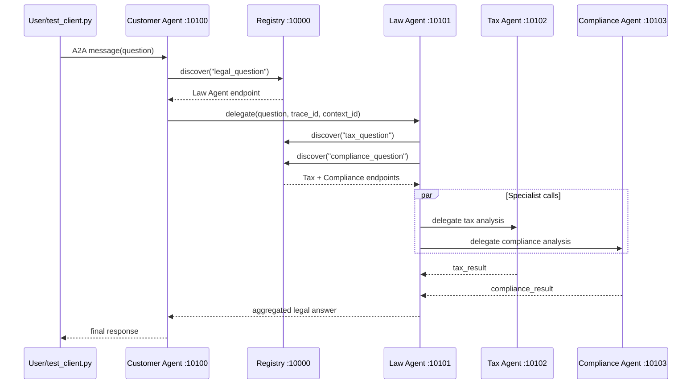

# Bao Cao Hoan Thanh Lab Day 9 - Multi-Agent MCP/A2A

## Tong Quan

Da doc va hoan thien cac phan con thieu trong lab:

- Stage 1: doi cau hoi demo va them `temperature=0.3` trong `common/llm.py`.
- Stage 2: them knowledge base ve luat lao dong, them tool `check_statute_of_limitations`, sua matching keyword tieng Viet dang cum tu.
- Stage 3: them tool `search_case_law` va bat `debug=True` cho ReAct agent.
- Stage 4: them `privacy_agent` cho ca demo stage va file exercise, them conditional routing va aggregate section.
- Stage 5: them do latency trong `test_client.py`, sua Tax Agent tra loi ngan gon hon, va them fast keyword routing trong Law Agent de giam mot lan goi LLM.
- Tao file `exercises/SOLUTIONS.md` vi tai lieu lab co nhac den file nay nhung repo chua co.

## Cac File Da Hoan Thien

- `common/llm.py`
- `stages/stage_1_direct_llm/main.py`
- `stages/stage_2_rag_tools/main.py`
- `stages/stage_3_single_agent/main.py`
- `stages/stage_4_milti_agent/main.py`
- `exercises/exercise_2_tools.py`
- `exercises/exercise_4_multiagent.py`
- `law_agent/graph.py`
- `tax_agent/graph.py`
- `test_client.py`
- `start_all.sh`
- `README.md`
- `exercises/SOLUTIONS.md`

Luu y: `exercises/SOLUTIONS.md` ton tai trong workspace, nhung hien bi `.gitignore` ignore boi pattern `**SOLUTION**`.

## Stage 5 Trace Request Flow



`trace_id`, `context_id`, va `delegation_depth` duoc propagate qua cac hop A2A de doc log va debug request.

## Dynamic Discovery / Fault Tolerance

Neu Tax Agent bi dung, `law_agent.call_tax()` se bat exception va tra ve section:

```text
[Tax analysis unavailable: ...]
```

He thong van tiep tuc aggregate cac phan con lai thay vi crash toan bo request.

## Latency Optimization

Baseline cua Law Agent dung LLM de routing tax/compliance, nen moi request ton them mot network LLM call.

Da ap dung toi uu:

- `law_agent/graph.py` mac dinh dung keyword routing (`FAST_KEYWORD_ROUTING=1`).
- Neu can so sanh baseline, chay voi `FAST_KEYWORD_ROUTING=0`.
- `test_client.py` da in `Latency: <seconds>` sau moi request.

Cach test:

```bash
./start_all.sh
uv run python test_client.py
```

So sanh baseline:

```bash
FAST_KEYWORD_ROUTING=0 ./start_all.sh
uv run python test_client.py
```

Ket qua do thuc te duoc ghi o phan "Kiem Tra" sau khi chay tren may co API/network.

## Kiem Tra

Da chay:

```bash
uv run python -m compileall common registry customer_agent law_agent tax_agent compliance_agent stages exercises test_client.py
```

Ket qua: pass, khong co loi syntax/import.

Da chay tool-level checks:

- Stage 2 `search_legal_database` match duoc entry `[labor_law]`.
- Stage 2 `check_statute_of_limitations("contract")` tra ve thoi hieu 4 nam.
- Exercise 2 `search_legal_knowledge` match duoc entry `[labor_law]`.
- Exercise 2 `check_statute_of_limitations("property")` tra ve thoi hieu 5 nam.
- Stage 3 co tool `search_case_law`.
- Exercise 4 routing goi duoc `privacy_agent` va `tax_agent`.
- Stage 4 routing goi duoc `call_privacy_specialist`.
- Law Agent fast routing goi duoc tax/compliance ma khong can LLM routing call.

Da build graph:

- `stages.stage_4_milti_agent.create_graph()`: pass.
- `exercises.exercise_4_multiagent.build_graph()`: pass.

Da chay thu Stage 5 E2E:

- Registry start OK.
- Tax Agent register OK.
- Compliance Agent register OK.
- Law Agent register OK.
- Customer Agent register OK.
- `test_client.py` ket noi duoc Customer Agent OK.
- Request LLM bi chan boi OpenRouter: `401 User not found`.

Vi vay Stage 5 ha tang local va A2A startup da hoat dong, nhung runtime LLM that can API key OpenRouter hop le de hoan tat response. Sau khi thay `OPENROUTER_API_KEY` hop le trong `.env`, chay lai:

```bash
./start_all.sh
uv run python test_client.py
```

`test_client.py` hien da in loi task failed ro rang va exit non-zero neu provider/API bi loi.
